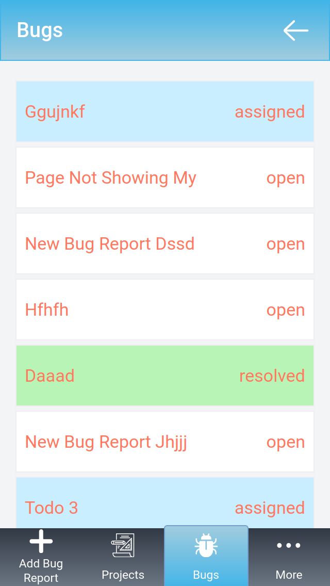

# bug-tracker
Frontend part of bug tracker app. Built with React and Redux.

## Project Description
This is a simple bug tracker app. The backend of this app is a REST API built with ROR.
The backend can be found here - [bug-tracker-REST-API](https://github.com/ershadul1/bug-tracker-REST-API)
User can track software bugs with this app.

## Features
- Users can signup, login.
- Create new projects.
- Add bug reports to existing projects.
- Assign bugs to themselves.
- Undo the bug assign.
- Change the bug status to resolved.
- Undo the resolve status.
- Users can comment on the bug reports.
- Bug reports are colored according to their 
  priority and status.
- More features are coming very soon :)

## Screenshots

|Report a bug|Bug details|
|-|-|
|||
|||

|All projects|All bugs|
|-|-|
|||
|||

|Login |More|
|-|-|
|||
|||

## Built With

- React
- Redux
- HTML/CSS
- Javascript
- Create React App

## Live Demo

- [bug-tracker](https://bug-tracker-rayhan.herokuapp.com/)

## How to run this project on your local machine

### Prerequisites
1. An internet browser
1. npm
1. react

   
### Steps to follow
1. Clone the repository to your local machine using `git clone https://github.com/ershadul1/bug-tracker.git`
1. On your local machine, navigate to the folder using `cd bug-tracker` in your terminal.
1. Run `npm install` for installing all the dependencies.
1. Run `npm start` to run the app on your local webserver.
1. Visit `http://localhost:3000/` to play the game from your browser.

## Available Scripts

In the project directory, you can run:

### `npm start`

Runs the app in the development mode.\
Open [http://localhost:3000](http://localhost:3000) to view it in the browser.

The page will reload if you make edits.\
You will also see any lint errors in the console.

### `npm test`

Launches the test runner in the interactive watch mode.\
See the section about [running tests](https://facebook.github.io/create-react-app/docs/running-tests) for more information.

### `npm run build`

Builds the app for production to the `build` folder.\
It correctly bundles React in production mode and optimizes the build for the best performance.

The build is minified and the filenames include the hashes.\
Your app is ready to be deployed!

See the section about [deployment](https://facebook.github.io/create-react-app/docs/deployment) for more information.

### `npm run eject`

**Note: this is a one-way operation. Once you `eject`, you can’t go back!**

If you aren’t satisfied with the build tool and configuration choices, you can `eject` at any time. This command will remove the single build dependency from your project.

Instead, it will copy all the configuration files and the transitive dependencies (webpack, Babel, ESLint, etc) right into your project so you have full control over them. All of the commands except `eject` will still work, but they will point to the copied scripts so you can tweak them. At this point you’re on your own.

You don’t have to ever use `eject`. The curated feature set is suitable for small and middle deployments, and you shouldn’t feel obligated to use this feature. However we understand that this tool wouldn’t be useful if you couldn’t customize it when you are ready for it.

## Contributions

  There are two ways of contributing to this project:

1.  If you see something wrong or not working, please check [the issue tracker section](https://github.com/ershadul1/bug-tracker/issues), if that problem you met is not in already opened issues then open the issue by clicking on the `new issue` button.

2.  If you have a solution to that, and you are willing to work on it, follow the below steps to contribute:
    1.  Fork this repository
    1.  Clone it on your local computer by running `git clone https://github.com/ershadul1/bug-tracker.git` __Replace *ershadul1* with the username you use on github__
    1.  Open the cloned repository which appears as a folder on your local computer with your favorite code editor
    1.  Create a separate branch of the *master branch*,
    1.  Write your codes that fix the issue you found
    1.  Commit and push the branch you created
    1.  Raise a pull request, comparing your new created branch with our original master branch [here](https://github.com/ershadul1/bug-tracker)

## Author 

👤 **Ershadul Rayhan**

- Github: [@ershadul1](https://github.com/ershadul1)
- Twitter: [@ErshadulRayhan](https://twitter.com/ErshadulRayhan)
- Linkedin: [ErshadulRayhan](https://www.linkedin.com/in/ershadulrayhan/)
- Email:  ershadul.rayhan@gmail.com

## Show your support

Give a ⭐️ if you like this project!

## Acknowledgments
- This project was inspired by the [Microverse](https:www.microverse.org) program
- The design of the project was originally taken from [behance](https://www.behance.net/gallery/13271423/Bodytrackit-An-iOs-app-Branding-UX-and-UI) created by [Gregoire Vella](https://www.behance.net/gregoirevella). Kudos to the designer.